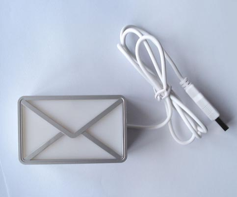
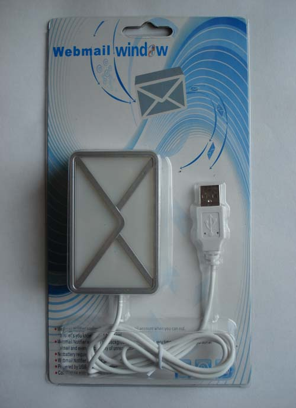
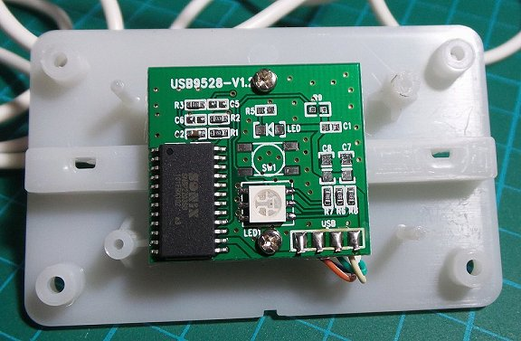

# UsbMailNotifier

###### Minimalist Windows C/C++ and Python code to control the "Mail Notifier" USB HID LED device.
Only intended to support this specific USB "Mail Notifier" HID device with a vendor ID of 0x1294 and a product ID of 0x1320.  
The 8 RGB color on/off version, not the 8bit color gradient version that came in the same package.  

That looks like this:    

Probably came in this kind of packaging or similar:    

#### Projects
* See the "C" folder for a Windows Visual Studio 2019 C/C++ project.
* See the "Python" folder for a basic Python script that works on Windows 10.

##### History
Little is known, other than these devices are from Asian manufacture(s) that originally hit the market around 2010 on eBay, Alibaba, etc.    
The original software that came on the little Panda CD ROM supported Windows 2000, Visa and XP.

Never tried any of the original software, that apparently was facilitated as a Windows service. My own use isn't for email notification, 
but for use as a status light for various software automation projects.

##### Hardware
The model I have has a *SN8P2203SB SONiX* 8-Bit MCU. An very minimal, lower power MCU, with a USB 1.1 controller, and using masked ROM (not reprogrammable). One might find an EPROM version of this chip to try to replace it with, but by then you might as well DIY one of the exiting STM32 "Blue Pill", or Arduino Pro Micro, etc., HID LED projects off the web.  

PCB photo from [tardate's](https://github.com/tardate/LittleArduinoProjects/tree/master/Electronics101/UsbNotifier) repo:          

##### Useful links
A C version for Mac OS X:    
https://github.com/tardate/LittleArduinoProjects/tree/master/Electronics101/UsbNotifier

A multiplatform C/C++ Linux, Mac, Windows USB library:  
https://github.com/libusb/hidapi  

A multiplatform C# library for USB HID devices:  
https://www.zer7.com/software/hidsharp  

Some possible projects to adapt to get this device to work as a notifier light for Slack, Skype, etc:    
https://github.com/gpailler/Luxa4Slack  
https://github.com/thomasjsn/Lync-presence-bridge  
https://github.com/coaxke/SkypeSignal  
https://www.hackster.io/matheus-fenner/skype-status-light-c2df6c  
https://github.com/f3nner/Skype-Status-Light-Bridge  
http://blink1.thingm.com/blink1-tool/  

Software that might work with the RGB model:   
https://github.com/ParsedID/USB-Mail-Notifier  

